# Projeto de referência Spring Boot
Projeto de referência spring boot com recursos essenciais para possibilitar integração contínua via jenkins e monitoramento via grafana e prometheus. 

# Tecnologias
- Spring Boot
- Tomcat 
- Flyway
- Hibernate Envers
- Jenkins
- Prometheus
- Grafana
- Docker
- Cucumber
- Swagger
- Postgres
- H2 (testes)

# Configuração de Ambiente

## Variáveis de ambiente

```
DATABASE_HOST=localhost
DATABASE_NAME=db
DATABASE_USER=admin
DATABASE_PASSWORD=admin
LOG_LEVEL=INFO
SHOW_SQL=true
PROFILE=dev
```
**OBS:** Essas configurações também podem ser substituídas diretamente no arquivo _application.yml_
 
## Criar volume docker

```shell script
docker volume create postgres
```

## Iniciar container do postgres

```shell script
docker-compose up  
```

# Documentação da API REST
A documentação da API é automatizada pela biblioteca swagger que também auxilia no consumo de APIs REST.

<h1 align="center">
    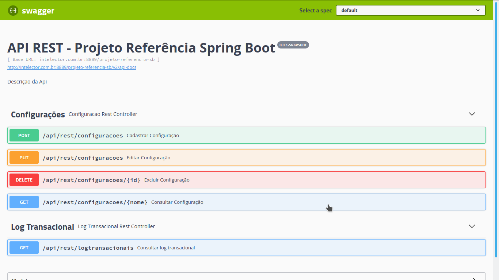
</h1>

# Log transacional + Rastreabilidade via TraceId

Os dados de logs transacionais são gerados com base no paradgma orientado a aspecto (POA) por meio do AspectJ e o auxilio do MDC (Mapped Diagnostic Context) para armazenar informações da transação.

Segue abaixo um modelo json extraído a partir de uma requisição ao serviço "/api/rest/logsTransacionais":

```json
{
  "id": 44,
  "dominio": "CONFIGURACAO",
  "operacao": "CADASTRAR",
  "chave": 1,
  "rev": 1,
  "traceId": "O6LVVKV7FV8PCY5",
  "requestPath": "/projeto-referencia-sb/api/rest/configuracoes",
  "responseStatus": 200,
  "responseErrors": null,
  "exception": null,
  "requestMethod": "POST",
  "requestQuery": null,
  "ip": "170.245.95.224",
  "usuario": "thiago.alessandro",
  "dataHoraInicio": "2020-09-29T00:41:42.934+0000",
  "dataHoraFim": "2020-09-29T00:41:45.477+0000",
  "tempoRespostaMs": 259
}
``` 

**OBS:** O campo **rev** representa a revisão do registro no contexto da auditoria (tabela tbl_revinfo).

# Auditoria

Os dados de revisão são gerados com auxílio do hibernate envers (biblioteca) que atua na camada de persistência junto à JPA (Java Persistence API).

Segue abaixo um modelo extraído da tabela **tbl_configuracao_aud** a qual armazena as revisões dos registros de tbl_configuracao: 

<h1 align="center">
    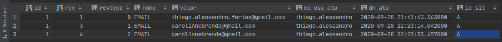
</h1>

A coluna **revtype** representa as seguintes operações:

```
0 = CADASTRAR
1 = EDITAR
2 = EXCLUIR
```

# Versionamento de script SQL

O versionamento dos scripts SQL sejam eles DML ou DDL ocorrem com auxílio do flyway possibilitando a execução/migração, automatização de processo CI (integração contínua) e também rollback no caso de mudanças.

Os scripts devem ser gerenciados no diretório "src/main/resources/db.migration".

Segue abaixo a versão atual da última migração através de uma requisição a "/actuator/flyway":

```json
{
  "contexts": {
    "application": {
      "flywayBeans": {
        "flyway": {
          "migrations": [
            {
              "type": "SQL",
              "checksum": 594974671,
              "version": "1.1",
              "description": "ddl",
              "script": "V1.1__ddl.sql",
              "state": "SUCCESS",
              "installedBy": "app_db",
              "installedOn": "2020-09-29T03:19:24.947Z",
              "installedRank": 1,
              "executionTime": 26
            }
          ]
        }
      },
      "parentId": null
    }
  }
}
```

# Versão Aplicação

A versão da aplicação está disponível através de uma consulta a "/actuator/info"

Segue abaixo o json com dados da versão da aplicação e data/hora da geração de build:

```json
{
  "build": {
    "version": "0.0.1-SNAPSHOT",
    "artifact": "projeto-referencia-sb",
    "name": "projeto-referencia-sb",
    "group": "br.com.packagebase",
    "time": "2020-09-29T01:51:24.899Z"
  }
}
```

# Testes

Testes de aceitação automatizados são executados com auxílio do cucumber (ferramenta de apoio ao BDD).

Segue abaixo o resultado da execução dos testes de aceitação da **feature configurações**:

<h1 align="center">
    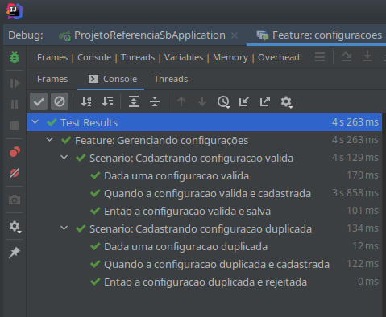
</h1>  

# Integração contínua

A integração contínua ocorre por meio do arquivo jenkinsfile que define uma pipeline com os seguintes steps:

<h1 align="center">
    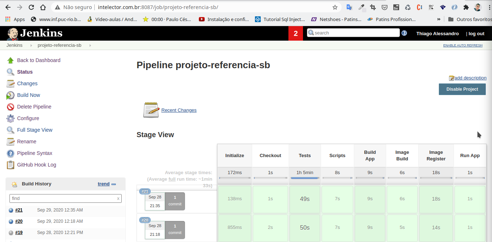
</h1>  

Detalhamento das steps:

1. Checkout da aplicação (git).
2. Execução de Testes (maven + cucumber).
3. Execução de scripts (flyway).
4. Geração de build  (maven).
5. Geração de imagem docker.
6. Registro de imagem docker no docker hub.
7. Execução de container com base na última imagem gerada. 

# Monitoramento

O monitoramento da aplicação ocorre através do **actuator** o qual reune métricas e expõe em tempo de execução.

## Actuator

<h1 align="center">
    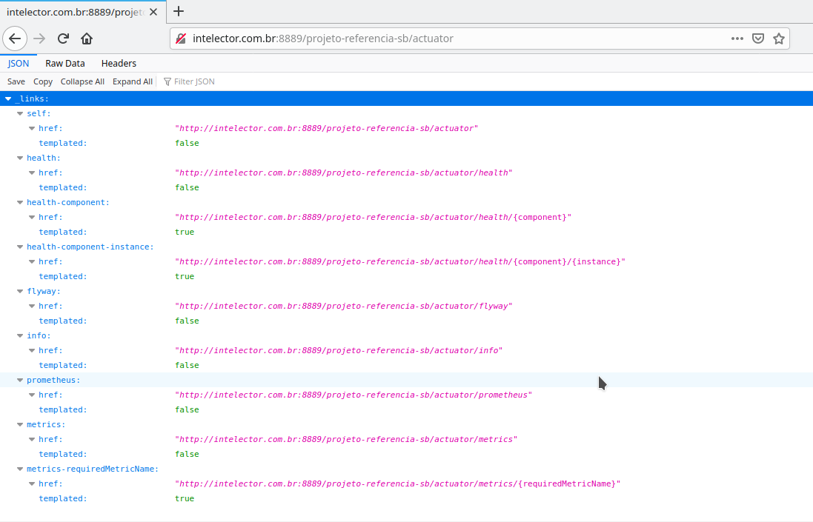
</h1>

## Prometheus (Micrometer)

<h1 align="center">
    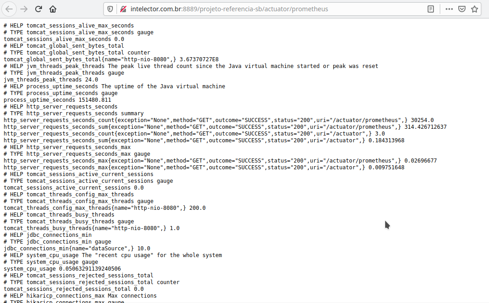
</h1>

## Grafana + Prometheus
<h1 align="center">
    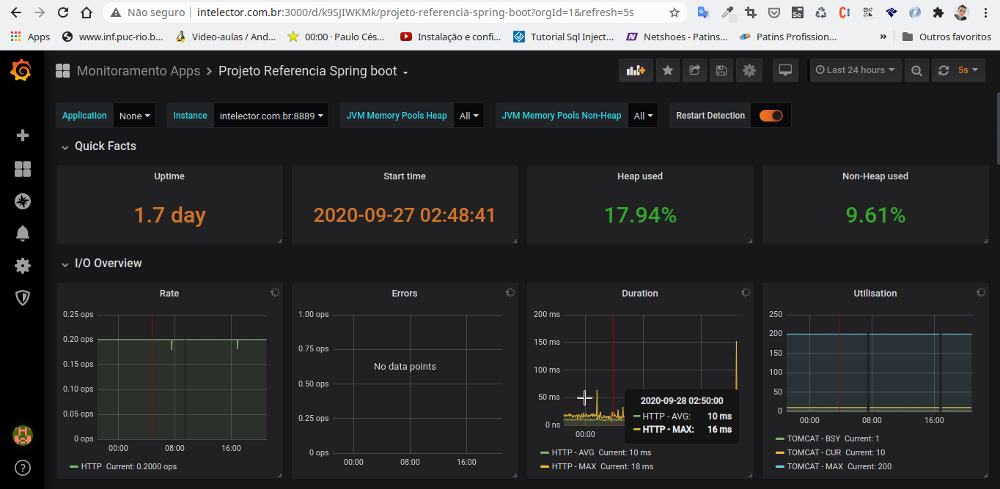
    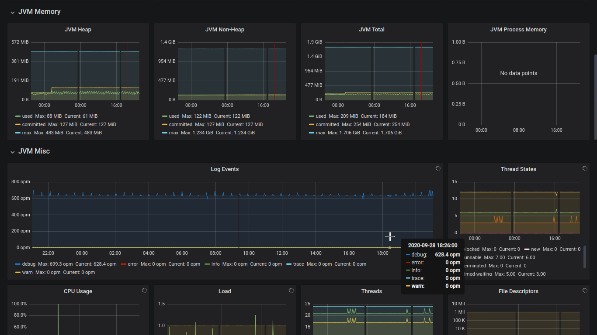
    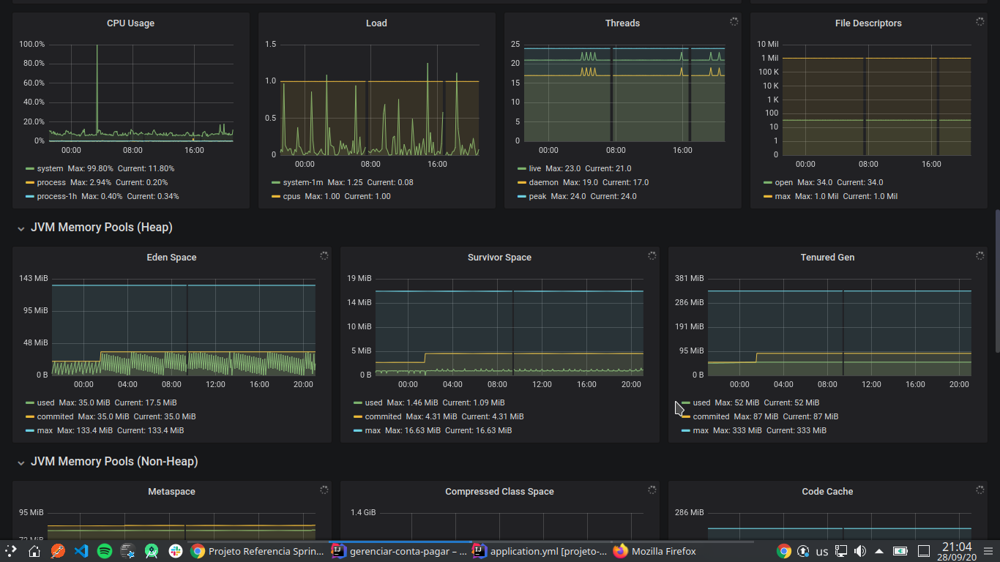
    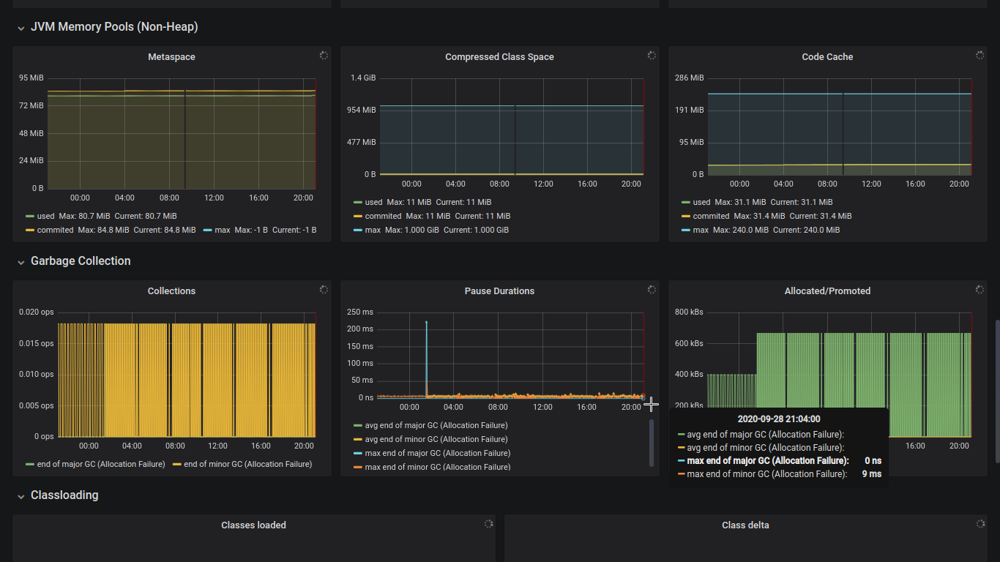
    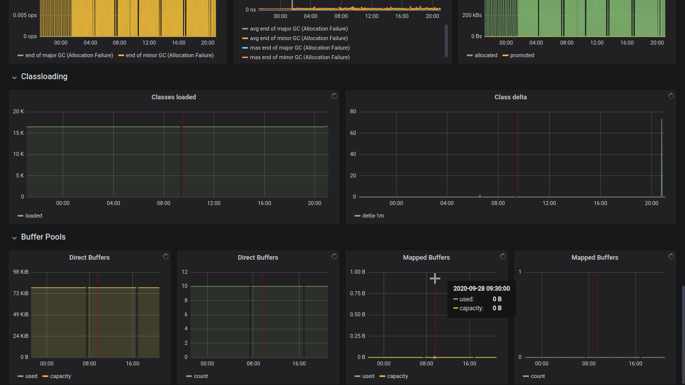
</h1>


### Documentação de referência

* [Official Apache Maven documentation](https://maven.apache.org/guides/index.html)
* [Spring Boot Maven Plugin Reference Guide](https://docs.spring.io/spring-boot/docs/2.3.3.RELEASE/maven-plugin/reference/html/)
* [Create an OCI image](https://docs.spring.io/spring-boot/docs/2.3.3.RELEASE/maven-plugin/reference/html/#build-image)
* [Spring Boot Actuator](https://docs.spring.io/spring-boot/docs/2.3.3.RELEASE/reference/htmlsingle/#production-ready)
* [Spring Web](https://docs.spring.io/spring-boot/docs/2.3.3.RELEASE/reference/htmlsingle/#boot-features-developing-web-applications)
* [Spring Data JPA](https://docs.spring.io/spring-boot/docs/2.3.3.RELEASE/reference/htmlsingle/#boot-features-jpa-and-spring-data)
* [Spring Boot DevTools](https://docs.spring.io/spring-boot/docs/2.3.3.RELEASE/reference/htmlsingle/#using-boot-devtools)
* [Prometheus](https://docs.spring.io/spring-boot/docs/2.3.3.RELEASE/reference/html/production-ready-features.html#production-ready-metrics-export-prometheus)
* [Cucumber](https://cucumber.io/)
* [Flyway](https://flywaydb.org/)
* [Jenkins](https://www.jenkins.io/)
* [Grafana](https://grafana.com/)
* [AspectJ](https://docs.spring.io/spring-framework/docs/3.0.0.M4/reference/html/ch07s02.html)
* [Hibernate Envers](https://hibernate.org/orm/envers/)
* [Swagger](https://swagger.io/)

