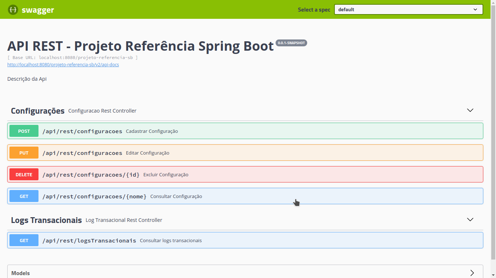

# Projeto de referência Spring Boot
Projeto de referência spring boot com recursos essenciais para possibilitar integração contínua via jenkins e monitoramento via grafana e prometheus. 

# Tecnologias
- Spring Boot
- Tomcat 
- Flyway
- Hibernate Envers
- Jenkins
- Prometheus
- Grafana
- Docker
- Cucumber
- Swagger
- Postgres
- H2 (testes)

# Configuração de Ambiente

## Variáveis de ambiente

```
DATABASE_HOST=localhost
DATABASE_NAME=db
DATABASE_USER=admin
DATABASE_PASSWORD=admin
LOG_LEVEL=INFO
SHOW_SQL=true
PROFILE=dev
```
OBS: Podem ser substituídas diretamente no arquivo _application.yml_
 
## Criar volume docker

```shell script
docker volume create postgres
```

## Iniciar container do postgres

```shell script
docker-compose up  
```

# Monitoramento

O monitoramento da aplicação ocorre por meio do **actuator** o qual reune métricas e as expõe em tempo de execução.

## Actuator

<h1 align="center">
    
</h1>

## Prometheus

<h1 align="center">
    
</h1>

## Grafana + Prometheus
<h1 align="center">
    
    
    
    
    
</h1>

# Documentação
A documentação da API é automatizada pelo swagger que também auxilia no consumo de APIs REST.

<h1 align="center">
    
</h1>

# Análise de log (Rastreabilidade) - TraceId
Incluir endpoint
Hora transação iniciada
Hora transação concluida 
Payload criptografado
Escrever sobre análise de log

# Auditoria
Incluir envers

# Versionamento de script SQL
Escrever sobre flyway

# Versão Aplicação
Escrever sobre o actuator

# Testes
Escrever sobre cucumber e funcionamento dos testes

# Escrever sobre integração continua com jenkins

Relatório de teste BDD em formato HTML 
~/target/cucumber/index.html
Tirar print


### Documentação de referência

* [Official Apache Maven documentation](https://maven.apache.org/guides/index.html)
* [Spring Boot Maven Plugin Reference Guide](https://docs.spring.io/spring-boot/docs/2.3.3.RELEASE/maven-plugin/reference/html/)
* [Create an OCI image](https://docs.spring.io/spring-boot/docs/2.3.3.RELEASE/maven-plugin/reference/html/#build-image)
* [Spring Boot Actuator](https://docs.spring.io/spring-boot/docs/2.3.3.RELEASE/reference/htmlsingle/#production-ready)
* [Spring Web](https://docs.spring.io/spring-boot/docs/2.3.3.RELEASE/reference/htmlsingle/#boot-features-developing-web-applications)
* [Spring Data JPA](https://docs.spring.io/spring-boot/docs/2.3.3.RELEASE/reference/htmlsingle/#boot-features-jpa-and-spring-data)
* [Spring Boot DevTools](https://docs.spring.io/spring-boot/docs/2.3.3.RELEASE/reference/htmlsingle/#using-boot-devtools)
* [Prometheus](https://docs.spring.io/spring-boot/docs/2.3.3.RELEASE/reference/html/production-ready-features.html#production-ready-metrics-export-prometheus)
